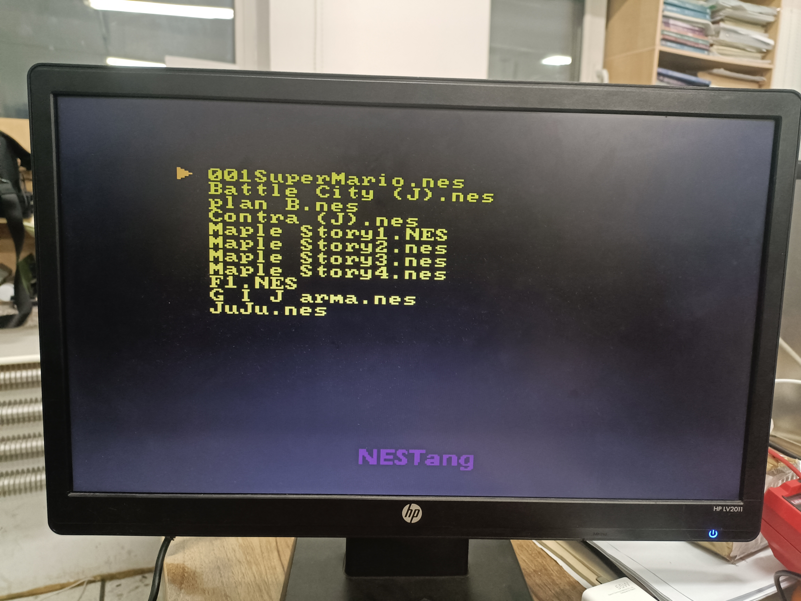
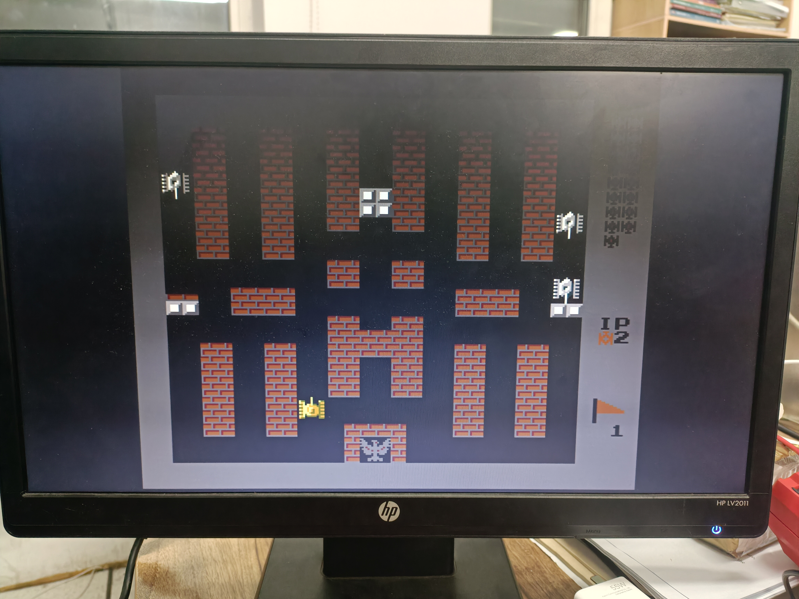

# NESTang - FPGA NES with Sipeed Tang 25K Boards

NESTang is an open source project to recreate the Nintendo Entertainment System (NES) with modern affordable FPGA boards. The main logic comes from [fpganes](https://github.com/strigeus/fpganes).

Main features,

- HDMI output with a resolution of 720p and sound capabilities.
- Cycle accurate gameplay quality has been achieved since the NES circuits have been almost entirely replicated.
- Game loading via MicroSD cards.
- Playstation 2 controller gamepads.

## Setup for Tang 25K

Here's what you need to run NESTang:

* The Tang 25K Dock.
* Sipeed ps2 controller adapters.
* Playstation controllers connected to the adapters.
* HDMI cable to connect the board to a monitor.
* A MicroSD card to hold ROMs.
* Insert the MicroSD card and power up the board to start playing your favorite games!

Follow the instructions below:

* Download this project.
* Put games into MicroSD and connect the PMODS as follows.

* Launch the **Gowin Programmer** application and program the `nes.fs` file, depending on your board. If your setup is correctly configured, a colorful NES palette should be displayed. 

* Press the up and down button to select games and press "〇" button open it.
* If the game does not load, restart.
* Enjoy and have fun!

## Development

If you want to generate the bitstream from source, see [Build Instructions](https://nand2mario.github.io/nestang-doc/dev/build_bitstream/).

## Special Thanks

* [fpganes](https://github.com/strigeus/fpganes) by Ludvig Strigeus.
* [hdl-util/hdmi](https://github.com/hdl-util/hdmi) by Sameer Puri.
* [NES for Tang Nano 9K](https://github.com/hi631/tang-nano-9K) by hi631

Since 2022.9
