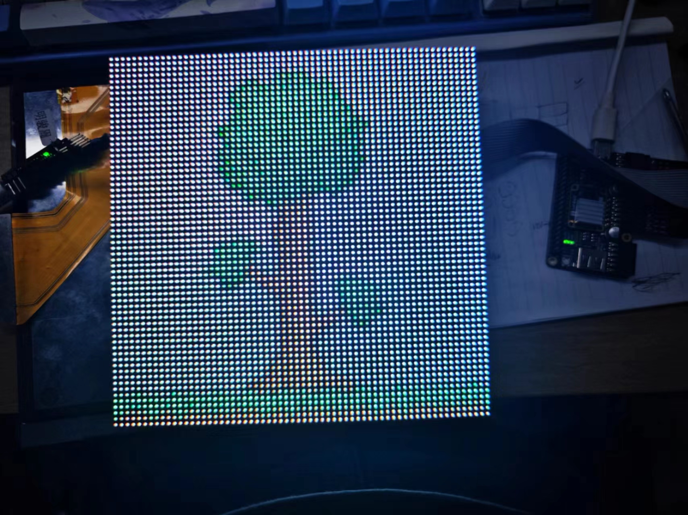
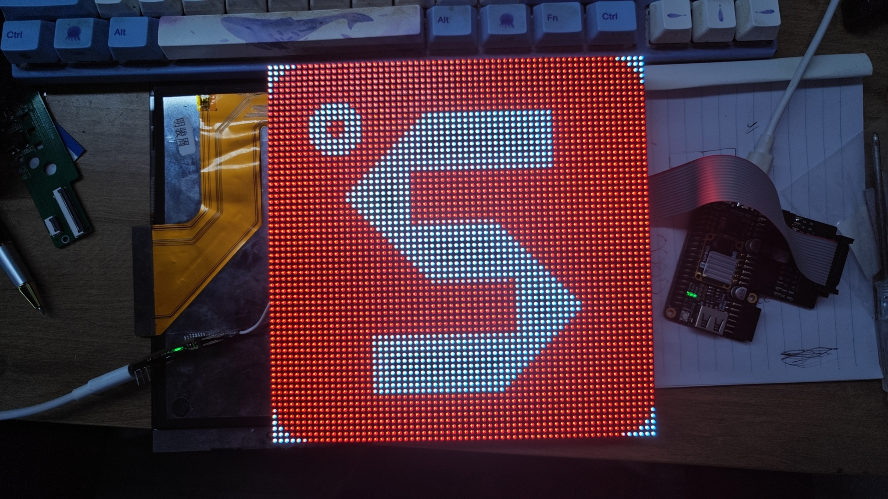

Connect PMOD_HUB75E to the 2 PMOD close to USB-C.   
Press S1 Key after burn flash.   




hex file generate by python code:   
```   
from PIL import Image
import numpy as np
im = Image.open("S.bmp")
img = np.array(im)
shape=img.shape
print("#File_format=Hex")
print("#Address_depth=%d"%(shape[0]*shape[1]/2))
print("#Data_width=32")
for y in range(32):
    for x in range(shape[1]):
        rgb1 = (img[y,x,2]>>3)|((img[y,x,1]>>3)<<5)|((img[y,x,0]>>3)<<10)
        rgb2 = (img[y+32,x,2]>>3)|((img[y+32,x,1]>>3)<<5)|((img[y+32,x,0]>>3)<<10)
        print("%04X%04X"%(rgb1, rgb2))
```


