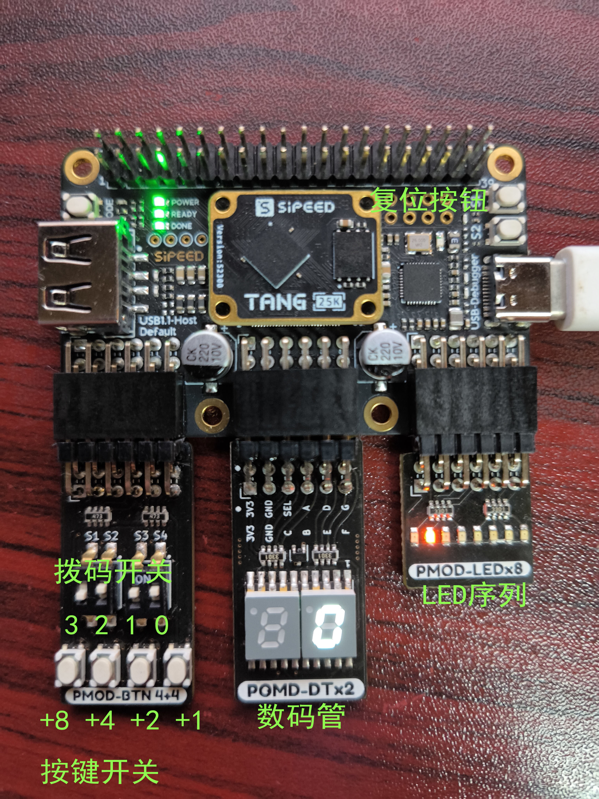

# Tang Primer 25K -example

## 例程之 按键开关/LED/数码管 PMOD例程

### 流程

+ 安装模组

  

在三个PMOD接口上，按顺序插上 按键开关模块，LED模块，数码管模块

+ 使用云源软件打开仓库中的pmod_ledButtonNixietube.gprj文件
+ 进行综合及布局布线，并烧录比特流。也可以直接使用Program Device烧录已经提前生成的bitstream文件（pmod_ledButtonNixietube\impl\pnr\pmod_ledButtonNixietube.fs）
+ 开发板右上角S1为复位按钮，外部上拉，故若使用其为复位按钮时在引脚约束需内部弱下拉(down)
+ 数码管及按键
  + 数码管10进制显示，初始为0；
  + 按第1个按键，数码管自增1；
  + 按第2个按键，数码管自增2；
  + 按第3个按键，数码管自增4；
  + 按第4个按键，数码管自增8
+ LED灯系列及拨码开关
  + 拨码开关 二进制表示，映射到 LED指示灯上。如拨码开关二进制表示为3,则第3个LED亮
  + 拨码开关最高位ON，则LED流水灯
### 注意事项
+ 若自行复刻，需在综合模块(Synthesize)右键配置(Configuration)，设置顶层模块
+ 

+ 还需再同界面的 Place & Route 的 Dual-Purpose Pin 设置IO复用
+ 

+ 开发板右上角S1为复位按钮，外部上拉，故若使用其为复位按钮时在引脚约束需内部弱下拉(down)