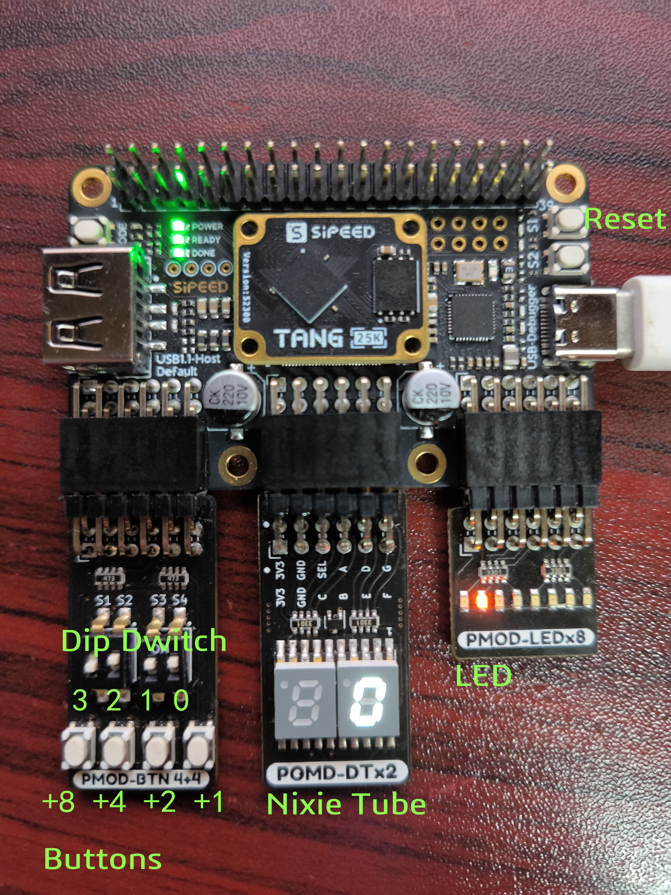
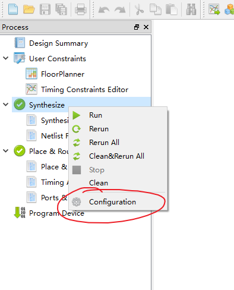

# Tang Primer 25K -example

## -Buttons/LED/Nixie Tube PMOD Example

### Operation Flow

+ Assemble

  

On the three PMOD interfaces, plug the key switch module, LED module, and digital tube module in order.

+ Open (pmod_ledButtonNixietube.gprj) using the GoWin SDK(ver > 1.99)
+ Execute the Synthesize and  Place & Route，then write the bitstream to Tang Primer 25K by Program Device.It is also possible to directly write to a pregenerated bitstream file using Program Device（pmod_ledButtonNixietube\impl\pnr\pmod_ledButtonNixietube.fs）
+ The upper right corner  of Tang Primer 25K is the reset button, which is external pull-up. Therefore, if it is used as the reset button, the internal weak pull-down is needed when the pin constraint is used
+ Nixie Tube and buttons
  + The nixie tube is displayed in decimal mode, and the initial value is 0.
  + Press the first button to add 1 to the nixie tube;
  + Press the second button to add 2 to the nixie tube;
  + Press the  third button to add 4 to the nixie tube;
  + Press the fourth button to add 8 to the nixie tube;
+ LED array and dip switch
  + The dip switch is represented in binary mode and mapped to the LED indicator. If the binary representation of the dial switch is 3, the third LED lights up.
  + The highest bit of the dial switch is HIGH, then the LED flow lamp.
### Tips
+ If you need the replication project, right-click Configuration in Synthesize and set the top-level module.
+ 
+ 

+ I/O multiplexing needs to be set with the Dual-Purpose Pin of Place & Route in the interface.
+ 

+ The upper right corner  of Tang Primer 25K is the reset button, which is external pull-up. Therefore, if it is used as the reset button, the internal weak pull-down is needed when the pin constraint is used
